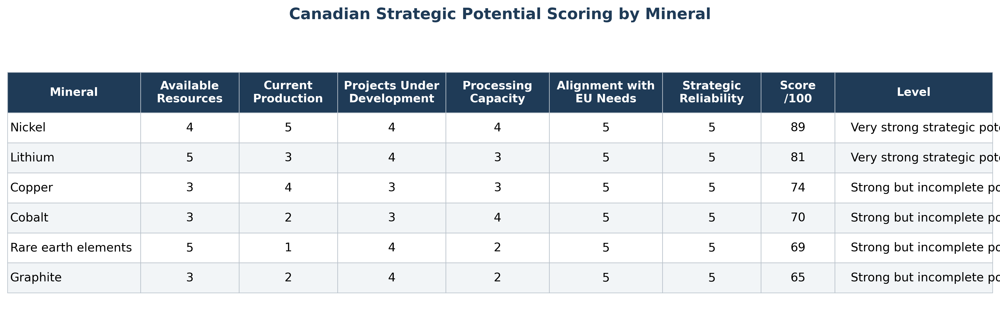
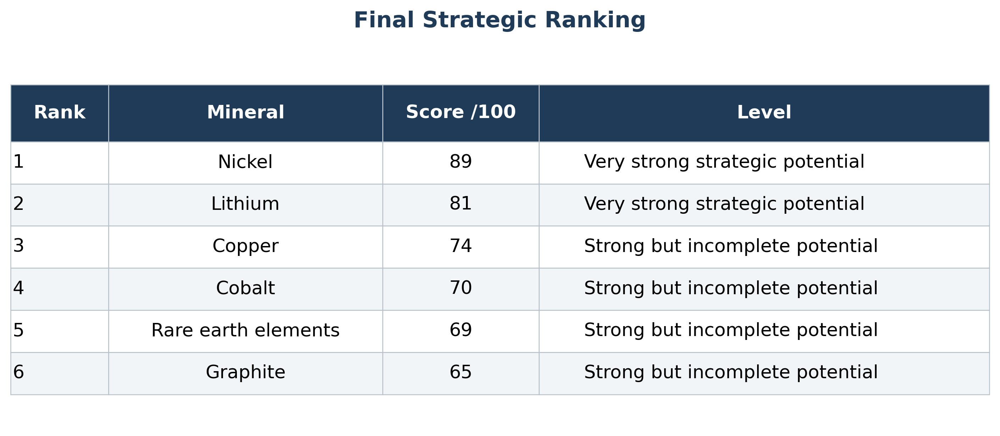
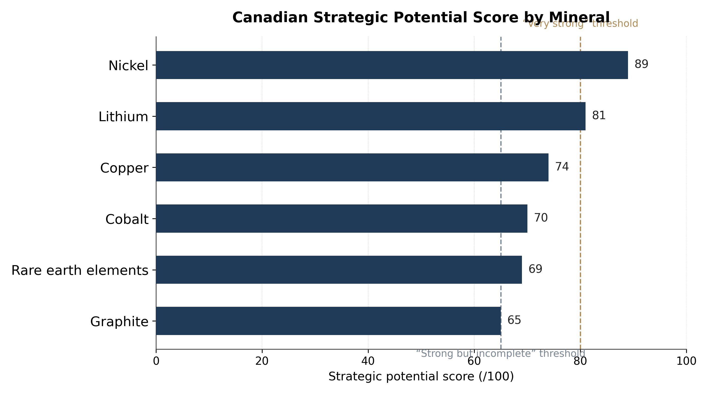
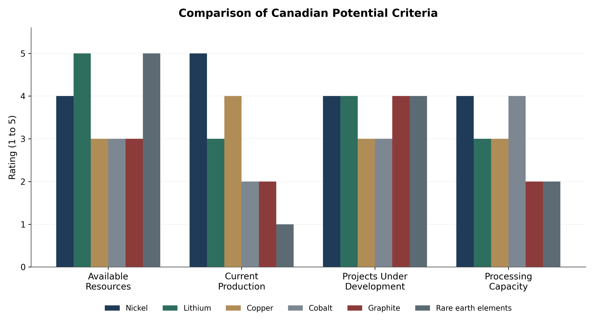
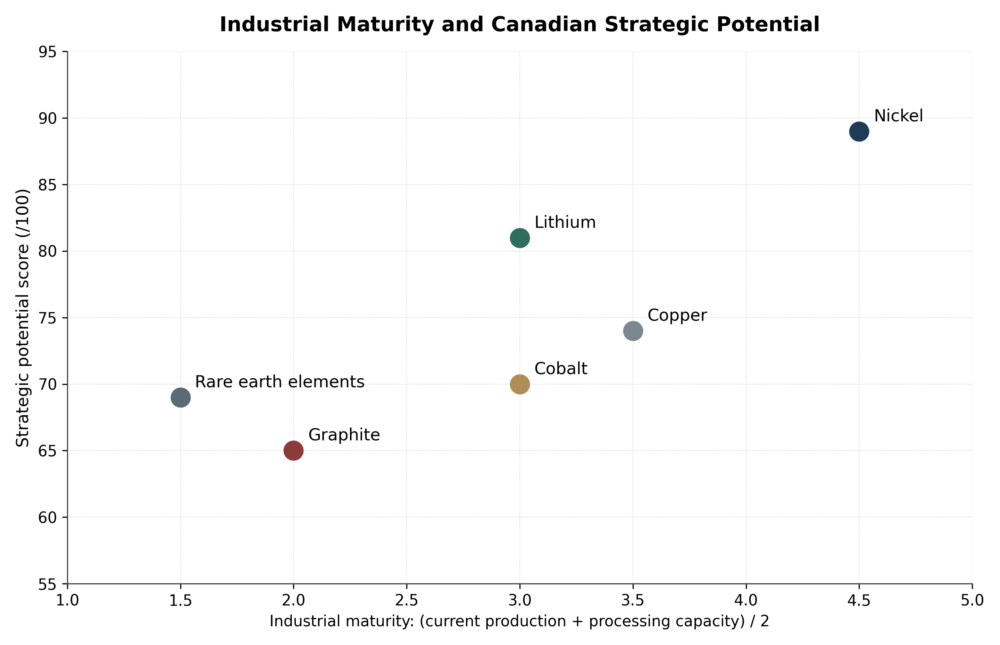

# Critical Minerals Strategy — Canada & Europe

Strategic economic analysis of Canada’s potential role in European critical mineral supply chains.

## Overview

This project examines whether Canada can become a credible diversification partner for Europe in critical minerals.

The study focuses on six strategic minerals:

- Nickel
- Lithium
- Copper
- Cobalt
- Graphite
- Rare earth elements

The objective is not only to compare geological resources, but also to assess production capacity, processing capabilities, industrial maturity and strategic relevance for Europe.

## Research Question

Can Canada become a credible strategic alternative for European critical mineral supply chains?

## Methodology

The analysis is based on institutional sources, including Natural Resources Canada, the Canadian Critical Minerals Strategy, the OECD and the International Energy Agency.

A comparative scoring model was built using six criteria:

- Available resources
- Current production
- Projects under development
- Processing capacity
- Alignment with European needs
- Strategic reliability

Each mineral receives a score out of 100, allowing a comparative assessment of Canada’s strategic potential.

## Data

The `data/` folder contains:

- `scoring_table.csv`: final ranking and strategic scores by mineral
- `methodology_criteria.csv`: criteria and weights used in the scoring model
- `canada_critical_minerals_scoring.xlsx`: Excel workbook used to build the scoring model and comparative analysis

## Reports

The `reports/` folder contains the full reports:

- [French report](reports/Canada_Critical_Minerals_Europe_Report_FR.pdf)
- [English report](reports/Canada_Critical_Minerals_Europe_Report_EN.pdf)

## Visual Outputs

The `outputs/` folder contains the main tables and charts produced for the analysis.

### Scoring table by mineral

### Final ranking

### Strategic score by mineral

### Criteria comparison

### Industrial maturity vs strategic potential

## Key Results

| Rank | Mineral | Score /100 | Strategic potential |
|---:|---|---:|---|
| 1 | Nickel | 89 | Very strong |
| 2 | Lithium | 81 | Very strong |
| 3 | Copper | 74 | Strong but incomplete |
| 4 | Cobalt | 70 | Strong but incomplete |
| 5 | Rare earth elements | 69 | Strong but incomplete |
| 6 | Graphite | 65 | Strong but incomplete |

## Main Conclusion

Canada can become a credible but partial diversification partner for Europe.

Nickel is the strongest short-term opportunity, supported by existing production and processing capacity. Lithium is highly promising, but still requires stronger industrial development. Copper and cobalt can support diversification, while graphite and rare earth elements remain more dependent on future processing and refining capacity.

The main lesson is that mineral sovereignty does not depend only on geological resources. It also depends on complete value chains: extraction, processing, refining and recycling.

## Skills Demonstrated

- Economic analysis
- Industrial strategy
- Critical minerals analysis
- Supply chain risk assessment
- Strategic scoring
- Data interpretation
- Excel-based analysis
- Report writing
- Policy-oriented analysis
